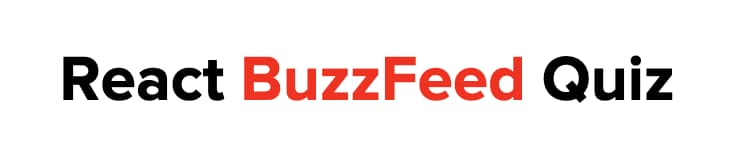

[![MIT License][license-shield]][license-url]

<!-- PROJECT LOGO -->
<br />
<p align="center">
   <a href="https://github.com/amamenko/react-buzzfeed-quiz">
    
  </a>
</p>
<p align="center">
  <a href="https://github.com/amamenko/react-buzzfeed-quiz">
    
  </a>
</p>
<p align="center">
  A <a href="https://www.buzzfeed.com">BuzzFeed</a>-style quiz component for React.js
  </p>
  
  
## Demo

Check out the demo page [here](https://react-buzzfeed-quiz.netlify.app)!

## Installation

`react-buzzfeed-quiz` is available through [Yarn](https://yarnpkg.com/package/react-buzzfeed-quiz):

```bash
yarn add react-buzzfeed-quiz
```

or through [npm](https://www.npmjs.com/package/react-buzzfeed-quiz):

```bash
npm install react-buzzfeed-quiz
```

Once it's installed, you can import the `BuzzFeedQuiz` component as follows:

```js
import { BuzzFeedQuiz } from "react-buzzfeed-quiz";
```

## Custom Styles

If you'd like to import the default `react-buzzfeed-quiz` CSS styles, you can import them like so:

```js
import "react-buzzfeed-quiz/lib/styles.css";
```

## Fonts

`react-buzzfeed-quiz` does not provide any fonts, but some recommended fonts that are often found on BuzzFeed quizzes are:

- [Proxima Nova](https://github.com/roshinthomas/Proximanova-fonts)
- [Pathway Gothic One](https://fonts.google.com/specimen/Pathway+Gothic+One)
- [PT Serif](https://fonts.google.com/specimen/PT+Serif)

## Example

Additional example can be found in the `example` directory. The package can be used as follows:

```js
import ProfilePhoto from "./path/to/ProfilePhoto.jpg";
import BackgroundImage from "./path/to/BackgroundImage.jpg";
import FirstResultImage from "./path/to/FirstResultImage.jpg";
import SecondResultImage from "./path/to/SecondResultImage.jpg";
import ResponseImage from "./path/to/ResponseImage.jpg";
import { BuzzFeedQuiz } from "react-buzzfeed-quiz";
import "react-buzzfeed-quiz/lib/styles.css";

const App = () => {
  return (
    <BuzzFeedQuiz
      title={"Your title goes here."}
      description={"Your description goes here."}
      byline={true}
      bylineAuthor={"Your name"}
      bylineAuthorLink={"www.yourlink.com"}
      bylineAuthorLinkOpenInNewTab={true}
      bylineAuthorTagline={"Your author tagline goes here"}
      bylineAvatarImageSrc={ProfilePhoto}
      autoScroll={true}
      onRestart={() => alert("This alert was triggered by the onRestart prop!")}
      onResult={() => alert("The onResult prop triggered this alert!")}
      onAnswerSelection={(questionIndex, answerIndex, resultID) =>
        console.log({
          questionIndex,
          answerIndex,
          resultID,
        })
      }
      facebookShareButton={true}
      facebookShareLink={"www.yourlink.com"}
      twitterShareButton={true}
      twitterShareLink={"www.yourlink.com"}
      copyShareButton={true}
      copyShareLink={"This text was copied using the copyShareLink prop."}
      questions={[
        {
          question: "Here's a default question",
          answers: [
            {
              answer: "Answer one",
              resultID: 0,
            },
            {
              answer: "Answer two",
              resultID: 1,
            },
            {
              answer: "Answer three",
              resultID: 2,
            },
          ],
        },
        {
          question: "Let's add some background and font colors",
          backgroundColor: "rgb(211, 211, 211)",
          fontColor: "#000",
          answers: [
            {
              answer: "First answer",
              backgroundColor: "red",
              fontColor: "rgb(215, 215, 215)",
              resultID: 0,
            },
            {
              answer: "Second answer",
              backgroundColor: "orange",
              fontColor: "green",
              resultID: 1,
            },
            {
              answer: "Third answer",
              backgroundColor: "yellow",
              fontColor: "#000",
              resultID: 2,
              revealResponse: {
                 title: "Here's an answer response!",
                 description: "Here's a description for the answer response!",
                 image: ResponseImage,
                 imageAttribution: "Answer response image attribution text goes here",
              },
            },
          ],
        },
        {
          question: "Here is some overlapping image text",
          questionRelativeToImage: "overlap",
          imageAttribution: "Question image attribution text goes here",
          answerArrangement: "tile",
          backgroundImageSrc: BackgroundImage,
          answers: [
            {
              answer: "This answer has a background photo",
              resultID: 0,
              backgroundImageSrc: BackgroundImage,
              imageAttribution: "Answer photo attribution text goes here",
            },
            {
              answer: "Not this one, though",
              resultID: 1,
              backgroundColor: "rgb(238,243,247)",
              fontColor: "rgb(53,51,48)",
            },
            {
              answer: "Not this one, either",
              resultID: 2,
              backgroundColor: "rgb(238,243,247)",
              fontColor: "rgb(53,51,48)",
            },
          ],
        },
        {
          question: "Here is some adjacent image text",
          questionRelativeToImage: "adjacent",
          answerArrangement: "row",
          backgroundImageSrc: BackgroundImage,
          answers: [
            {
              answer: "Answer one",
              resultID: 0,
            },
            {
              answer: "Answer two",
              resultID: 1,
            },
            {
              answer: "Answer three",
              resultID: 2,
            },
          ],
        },
        {
          question: "Answers can also trigger a callback function",
          answers: [
            {
              answer: "This one does not trigger a function",
              resultID: 0,
            },
            {
              answer: "Click for answer function",
              onAnswerSelection: (questionIndex, answerIndex, resultID) =>
                alert("This alert is caused by an answer selection!"),
              resultID: 1,
            },
          ],
        },
      ]}
      results={[
        {
          title: "Your first result title goes here",
          description: "Your first result description goes here",
          resultImageSrc: FirstResultImage,
          imageAttribution: "Your photo attribution text goes here",
          resultID: 0,
        },
        {
          title: "Your second result title goes here",
          description: "Your second result description goes here",
          resultImageSrc: SecondResultImage,
          resultID: 1,
        },
        {
          title: "Your third result title goes here",
          description: "Result images and attributions are optional!",
          resultID: 2,
        },
      ]}
    />
  );
};
```

## Disclaimer

`react-buzzfeed-quiz` is not affiliated, associated, authorized, endorsed by, or in any way officially connected with BuzzFeed, Inc., or any of its subsidiaries or its affiliates. The official BuzzFeed, Inc. website can be found at [https://www.buzzfeed.com](https://www.buzzfeed.com).

The name BuzzFeed as well as related names, marks, emblems/logos, and images are registered trademarks of BuzzFeed, Inc.

## User Guide

### API

The `BuzzFeedQuiz` component accepts the following props:

| Name                         | Type          | Default | Description                                                                                                                                                                                                  |
| ---------------------------- | ------------- | ------- | ------------------------------------------------------------------------------------------------------------------------------------------------------------------------------------------------------------ |
| title                        | string        | `""`    | The main title header for the quiz.                                                                                                                                                                          |
| description                  | string        | `""`    | The sub-heading description for the quiz.                                                                                                                                                                    |
| byline                       | boolean       | `true`  | Whether or not to render the author information sub-header.                                                                                                                                                  |
| bylineAuthor                 | string        | `""`    | The name of the quiz creator. Only takes effect when `byline` prop is set to `true`.                                                                                                                         |
| bylineAuthorLink             | string        | `""`    | URL to redirect to when byline author name is clicked. Only takes effect when `byline` prop is set to `true`.                                                                                                |
| bylineAuthorLinkOpenInNewTab | boolean       | `false` | Whether or not to open a new tab when redirecting to the byline author link URL upon author name click. Only takes effect when `byline` prop is set to `true`.                                               |
| bylineAuthorTagline          | string        | `""`    | Additional text to render under the author name in the byline. Only takes effect when `byline` prop is set to `true`.                                                                                        |
| bylineAvatarImageSrc         | string        | `true`  | URL or local filename to be included in the byline's circular avatar image's `src` attribute. Only takes effect when `byline` prop is set to `true`.                                                         |
| generalBackgroundColor       | string        | `""`    | Applies a given color to every question container and every answer container's background. If no color or invalid color is supplied, the default background color is black.                                  |
| generalFontColor             | string        | `""`    | Applies a given color to every question container and every answer container's font. If no color or invalid color is supplied, the default font color is white.                                              |
| autoScroll                   | boolean       | `true`  | Whether or not to automatically smooth-scroll the quiz to the next available question upon answer selection, to the result when the quiz is finished, and to the top of the quiz when the quiz is restarted. |
| facebookShareButton          | boolean       | `true`  | Whether or not to include the Facebook share button in the result container.                                                                                                                                 |
| facebookShareLink            | string        | `""`    | URL to share to Facebook upon clicking the Facebook share button.                                                                                                                                            |
| twitterShareButton           | boolean       | `true`  | Whether or not to include the Twitter share button in the result container.                                                                                                                                  |
| twitterShareLink             | string        | `""`    | URL to share to Twitter upon clicking the Twitter share button.                                                                                                                                              |
| twitterShareText             | string        | `""`    | Text to pre-fill shared tweet (keep in mind Twitter's current 280 character limit).                                                                                                                          |
| twitterShareHashtags         | Array[string] | `[]`    | Array of strings that should be marked as hashtags of the shared tweet.                                                                                                                                      |
| copyShareButton              | boolean       | `true`  | Whether or not to include the "Copy Link" (or 🔗) button in the result container.                                                                                                                            |
| copyShareLink                | string        | `""`    | The text that should be copied to the clipboard upon clicking the "Copy Link" (or 🔗) button.                                                                                                                |
| onResult                     | Function      | `NOOP`  | Function called when the quiz is completed and a result is available.                                                                                                                                        |
| onAnswerSelection            | Function      | `NOOP`  | Function called when any answer option is selected. The question's index, the answer's index, and the answer's associated result ID are available as parameters.                                             |
| onRestart                    | Function      | `NOOP`  | Function called when the "Retake Quiz" button is clicked in the result container.                                                                                                                            |
| questions                    | Array[Object] | `[]`    | An array of question objects (see Question Object below).                                                                                                                                                    |
| results                      | Array[Object] | `[]`    | An array of result objects (see Result Object below).                                                                                                                                                        |

### Question Object

`BuzzFeedQuiz`'s `questions` prop accepts an array of question objects with key-value pairs formatted in the following manner:

| Key Name                | Value Type    | Value Description                                                                                                                                                                                                                                                                                                                                                                                         |
| ----------------------- | ------------- | --------------------------------------------------------------------------------------------------------------------------------------------------------------------------------------------------------------------------------------------------------------------------------------------------------------------------------------------------------------------------------------------------------- |
| question                | string        | The text value of the question being asked.                                                                                                                                                                                                                                                                                                                                                               |
| questionRelativeToImage | string        | Determines whether the question text's position overlaps a supplied image or whether the question text is displayed directly above the image (adjacently). Provide a value of `"adjacent"` to this key for the latter option, otherwise the text will overlap by default.                                                                                                                                 |
| answerArrangement       | string        | Determines the spacial orientation of the answer choices. Assign this key a value of `"row"` for each answer text to be on a separate line (Note: only answer text will show - no background images or image attributions) or a value of `"tile"` for Buzzfeed's default tile configuration.                                                                                                              |
| backgroundColor         | string        | Applies a given color to only the specific question container's background. This value supersedes the `generalBackgroundColor` prop if supplied to `ReactBuzzFeedQuiz`. If the `generalBackgroundColor` prop is supplied and this value is empty, then the color in `generalBackgroundColor` will be applied. Otherwise, if no color or invalid color is supplied, the default background color is black. |
| fontColor               | string        | Applies a given color to only the specific question container's font. This value supersedes the `generalFontColor` prop if supplied to `ReactBuzzFeedQuiz`. If the `generalFontColor` prop is supplied and this value is empty, then the color in `generalFontColor` will be applied. Otherwise, if no color or invalid color is supplied, the default font color is white.                               |
| backgroundImageSrc      | string        | URL or local filename to be included as the background image of the question container. Automatically sets the font color to white and adds a text stroke. Takes precedence over any theme, if supplied.                                                                                                                                                                                                  |
| imageAttribution        | string        | If background image is supplied, this will add attribution text below the image giving credit to its original source.                                                                                                                                                                                                                                                                                     |
| answers                 | Array[Object] | An array of answer objects (see Answer Object below).                                                                                                                                                                                                                                                                                                                                                     |

#### Answer Object

The value of the `answers` key of the Question Object accepts an array of answer objects with key-value pairs formatted in the following manner:

| Key Name           | Value Type | Value Description                                                                                                                                                                                                                                                                                                                                                                                       |
| ------------------ | ---------- | ------------------------------------------------------------------------------------------------------------------------------------------------------------------------------------------------------------------------------------------------------------------------------------------------------------------------------------------------------------------------------------------------------- |
| answer             | string     | The text value of the answer choice.                                                                                                                                                                                                                                                                                                                                                                    |
| backgroundColor    | string     | Applies a given color to only the specific answer container's background. This value supersedes the `generalBackgroundColor` prop if supplied to `ReactBuzzFeedQuiz`. If the `generalBackgroundColor` prop is supplied and this value is empty, then the color in `generalBackgroundColor` will be applied. Otherwise, if no color or invalid color is supplied, the default background color is black. |
| fontColor          | string     | Applies a given color to only the specific answer container's font. This value supersedes the `generalFontColor` prop if supplied to `ReactBuzzFeedQuiz`. If the `generalFontColor` prop is supplied and this value is empty, then the color in `generalFontColor` will be applied. Otherwise, if no color or invalid color is supplied, the default font color is white.                               |
| backgroundImageSrc | string     | URL or local filename to be included as the background image of the answer container. Automatically sets the font color to white and adds a text stroke. Takes precedence over any theme, if supplied.                                                                                                                                                                                                  |
| imageAttribution   | string     | If background image is supplied, this will add attribution text below the image giving credit to its original source.                                                                                                                                                                                                                                                                                   |
| onAnswerSelection  | Function   | Function called when this specific answer option is selected. The question's index, the answer's index, and the answer's associated result ID are available as parameters. This function value supersedes `ReactBuzzFeedQuiz`'s `onAnswerSelection` prop, if supplied, for this specific answer choice.                                                                                                 |
| resultID           | number     | The numerical ID of the answer's associated Result Object (see below) found in `ReactBuzzFeedQuiz`'s `results` prop.                                                                                                                                                                                                                                                                                    |
| revealResponse     | Object     | Triggers a response message for this specific answer below the associated question and its answer options (see Response Object below). |

### Response Object
              
`BuzzFeedQuiz`'s Answer Objects accept an optional `revealResponse` key object with key-value pairs formatted in the following manner:

| Key Name         | Value Type | Value Description                                                                                                                                                                                        |
| ---------------- | ---------- | -------------------------------------------------------------------------------------------------------------------------------------------------------------------------------------------------------- |
| title            | string or JSX element     | The heading value of the associated answer response.                                                                                                                                                         |
| description      | string or JSX element     | The lower sub-heading value of the associated answer response.                                                                                                                                                    |
| image   | string     | URL or local filename to be included in the answer response image's `src` attribute.                                                                                                                    |
| imageAttribution | string     | This will add attribution text below the answer response image giving credit to the image's original source.                                                                               |

### Result Object

`BuzzFeedQuiz`'s `results` prop accepts an array of result objects with key-value pairs formatted in the following manner:

| Key Name         | Value Type | Value Description                                                                                                                                                                                        |
| ---------------- | ---------- | -------------------------------------------------------------------------------------------------------------------------------------------------------------------------------------------------------- |
| title            | string     | The heading text value of the associated result.                                                                                                                                                         |
| description      | string     | The text value of the sub-heading result description.                                                                                                                                                    |
| resultImageSrc   | string     | URL or local filename to be included in the result container image's `src` attribute.                                                                                                                    |
| imageAttribution | string     | This will add attribution text below the result description giving credit to the result container image's original source.                                                                               |
| onResult         | Function   | Function called when the quiz is completed and the outcome is this specific result. This function value supersedes `ReactBuzzFeedQuiz`'s `onResult` prop, if supplied, for this specific result outcome. |
| resultID         | number     | The numerical ID of the Result Object. Used to associate Result Objects to Answer Objects.                                                                                                               |

<!-- CONTRIBUTING -->

## Contributing

Contributions are welcome!

1. Fork the project.
2. Create your feature branch (`git checkout -b feature/MyFeature`).
3. Commit your changes (`git commit -m 'Add my feature'`).
4. Push to the branch (`git push origin feature/MyFeature`).
5. Open a pull request.

<!-- LICENSE -->

## License

Distributed under the MIT License. See `LICENSE.txt` for more information.

<!-- MARKDOWN LINKS & IMAGES -->
<!-- https://www.markdownguide.org/basic-syntax/#reference-style-links -->

[license-shield]: https://img.shields.io/github/license/othneildrew/Best-README-Template.svg?style=for-the-badge
[license-url]: https://github.com/amamenko/react-buzzfeed-quiz/blob/master/LICENSE.txt
